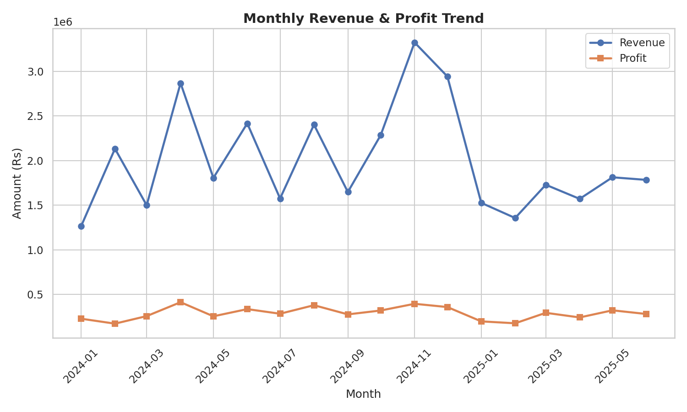
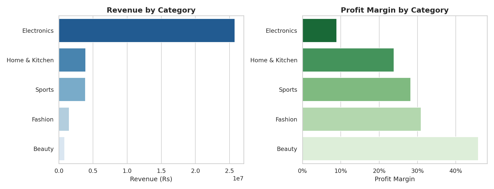
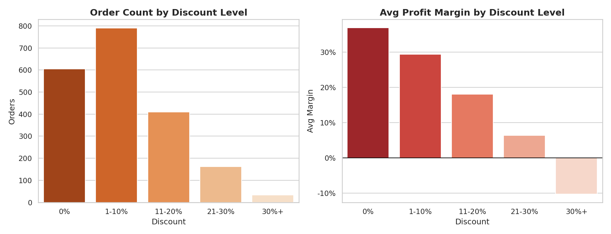
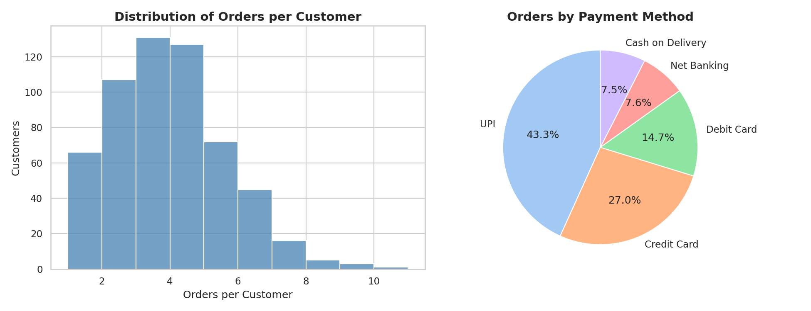
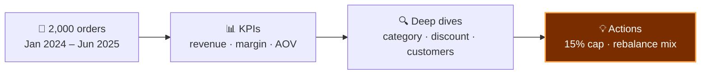

<div align="center">
  
</div>

<p align="center">
  
</p>

<p align="center">
  
  
  
  
  
  
</p>

> **₹3.59 crore in revenue across 2,000 orders** — and a discount policy quietly burning lakhs. This project traces every rupee: which categories earn, which discounts destroy margin, and which customers actually matter.

---

## 📊 The headline numbers

| Metric | Value |
|---|---|
| Orders analyzed | 2,000 (Jan 2024 – Jun 2025) |
| Total revenue | **₹3,59,28,969** |
| Money lost to deep discounting | **~₹2.5 lakh** across 195 orders |
| Revenue from top 10% of customers | **41.2%** |



## ⚠️ Finding #1 — the margin-mix trap

Electronics drives **72% of revenue (₹2.58 Cr)** — at an **8.9% margin**. The business is scaling its thinnest slice. Meanwhile Beauty earns **45.9% margin** on just 2% of revenue. Growth without rebalancing is just expensive volume.



## 🔥 Finding #2 — discounts are subsidizing losses

Orders discounted **21%+ carry negative margins** — the company paid customers to buy. Just 195 such orders burned **~₹2.5 lakh**. The fix isn't subtle: **cap blanket discounting at 15%**, replace site-wide sales with targeted offers.



## 👑 Finding #3 — the loyal core

The **top 10% of customers generate 41.2% of revenue**, and UPI dominates payments (43% of orders). Retention spend aimed at this core beats acquisition spend aimed at everyone.



---

## ⚙️ How it works



## 📂 What's inside

```
├── generate_data.py               # synthetic order data, seed 42
├── analysis.py                    # KPIs → deep dives → charts
├── build_notebook.py              # builds the notebook from the pipeline
├── Ecommerce_Sales_Analysis.ipynb # narrated case-study notebook (29 cells)
├── findings.md                    # stakeholder summary
├── data/
│   └── ecommerce_sales.csv        # 2,000 orders × 13 columns
└── visuals/                       # 7 charts (shown above)
```

## ▶️ Run it

```bash
pip install -r requirements.txt
python3 generate_data.py    # build the dataset
python3 analysis.py         # full analysis + 7 charts
```

Or open the notebook — same analysis, narrated step by step. Deterministic: rebuild from scratch, every number reproduces exactly.

---

## 🔭 Where I'd take it next

- **Price elasticity model** — estimate demand response per category so discounts are *priced*, not guessed.
- **RFM segmentation** — recency/frequency/monetary tiers to target the 41.2% core with surgical offers.
- **Promo cannibalization analysis** — do site-wide sales steal from full-price weeks? Measure it before running the next one.

---

*Synthetic order data (seed 42) with realistic retail behavior — seasonal demand, category margin structure, and discount response baked in. Pipeline works identically on live sales data.*

<div align="center">
  
</div>
